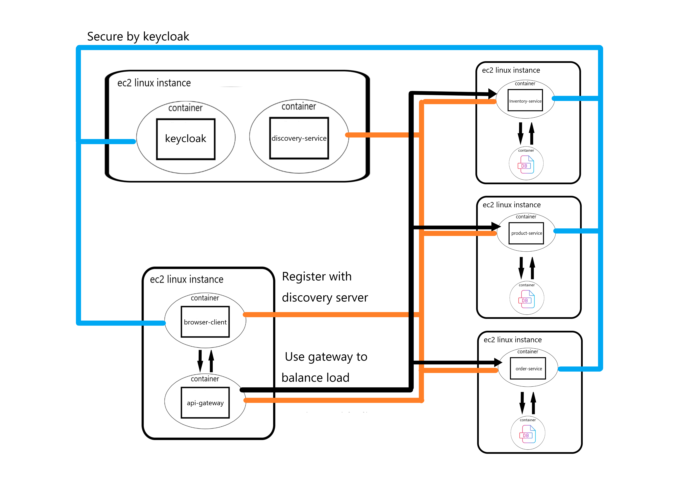

# [shopping-application](http://shopping-app.tangpoyu.click/home)

This project is for learing Web developent about Spring boot, Spring security, Spring Cloud, AWS EC2, and Docker.

## App Objective:
Implement a application which mocks to supply product to consumer in a microservice architecture.

## App architecture:

### Security
* use keycloak to enable the authorization code flow to authenticate a user, in the case where user is authenticated failed, the user will be 
requested to retry login flow, and in another case where user is authenticated successfully, then the system will save the authentication principal in
security context, and redirect the user to the home or requested page, and display the interface according the role the user has, and if there is a malicious user
who intentionally accesses the page where only admin can access through url, then system will retuen 403 forbidden error.

### Service discover
* client and each service will register with eureka server with self location information, and the client will use webclient to call the gateway service through 
the registry fetched from eureka server in a load balance way, then gateway will also route the request to api in same way, through this mechanism can make the system
scalable and and make the resource of system is used effectively.

### Observability
* use the Opentelemetry java agent to dynamically injects bytecode to capture telemetry data at the edges of service, such as inbound request, outbound http call,
database call, and so on, though this the action which occur in open time of scope will be added the span id and trace id, and then we can configure the agent to
export these data to tempo cloud, and configure the loki logback to export the log information to the loki cloud, in addition to this, the java agent also supply 
the information about system metric, and then we can configure the agent to export the metric to the opentelemetry collector which run in another docker contanier
through grpc protocol which listen to 0.0.0.0:4317, and then configure the collector to export the metric to prometheus cloud, as a result we can use the Grafana 
cloud to visualize the system data for a better understanding about self system which can be useful for the bug fixes and performance improvement.

## Operation of App:

### Admin 

This system supplys a admin user to manage this app which has admin role. ( username: admin, password: admin )

* Login : admin can login through filling up the crendentials

* Create product: admin can add product to the inventory.

* View all product: admin can view products which in sale.

* View all Inventory: admin can view inventories.

* Logout : admin can logout by clicking the logout button on the top right.

****

### User

* Register user : through login page, you can register a user by register link, and will be mapped a user role by default.

* Login : user can login through filling up the crendentials.

* Logout : user can logout by clicking the logout button on the top right.

* View all product: user can view products which in sale.

* Add to cart: user can add number of product to cart.

* View cart: user can see which product have been added to cart.

* Place Order: user can select which products in cart which will form a order after clicking the place order button.

* Order tracking: user can view the status and product detail of order.

