# [shopping-application](http://shopping-app.tangpoyu.click/home)

This project is for learning Web development about Spring boot, Spring security, Keycloak, Spring Cloud, thymeleaf template engine, Grafana Stack, AWS EC2, and Docker.

## App Objective:
Implement an application which mocks to supply product to consumer in a microservice architecture.

## App architecture:
This app has a frontend(browser-client)which is built with spring boot through thymeleaf template engine to render processed data on template and three backend 
(inventory-service, order-service, product-service) which are all built with spring boot, and for the sake of efficient load balancing in the cloud environment
and flexibility and scalability in microservices architectures, I put a spring cloud gateway(api-gateway) between frontend and backend and a Eureka(discover-service) to 
maintain a registry of all services' ip address dynamically, so that all services in this system can easily locate and interact with each other without knowing the 
exact ip address of each other and hardcoding a fixed values in source code which causes a tight coupling that isn't a good practice about SOLID principal and makes 
this system less maintainable, less extensible, and harder to test, and in order to ensure the security of this app, I chose keycloak as my IAM solution
to supply modern authentication protocols based on OAuth 2.0 and OpenID Connect, and in term of CI/CD, they are all containerized with docker
which can facilitate the efficient and reliable delivery of code changes from development to production environments and are all deployed on AWS EC2 instance
which is of type linux, and lastly in term of observability, they are partially monitored using Grafana Cloud technical stack for visualization and analytics of time series data.

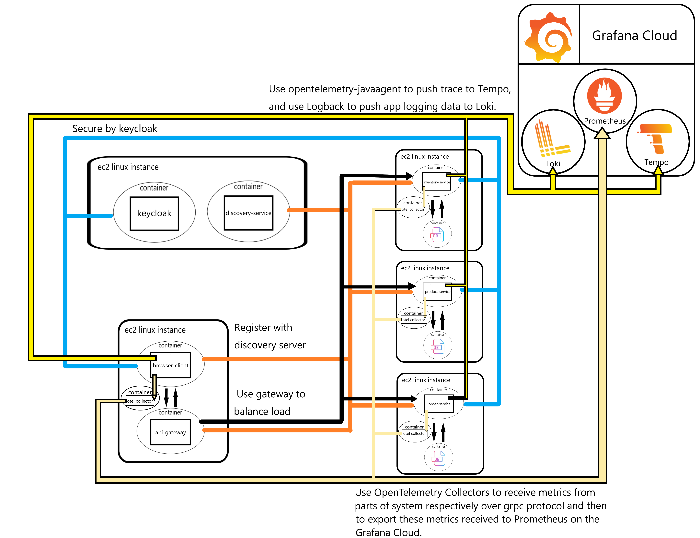

### Security
In the context of security, the frontend(browser-client) is referred to as Client and backend (inventory-service, order-service, product-service) 
is referred to as resource server which are all being protected by authorization server(Keycloak), 
and because the frontend is built with thymeleaf which is a server-side java template engine,
I chose confidential client as its access type and authorization code grant as its authorization grant to authenticate a user, in the case 
where user is authenticated failed, the user will be requested to retry login flow, and in another case where user is authenticated successfully, then 
the system will save the authentication principal in security context, and redirect the user to the home or requested page,
and display the interface according the role the user has, and if there is a malicious user who intentionally accesses the page where only admin can access 
through url, then system will return 403 forbidden error, and because of client's access type, the identity of client will also be authenticated with authorization 
server(Keycloak) always through matching the client secret received with the one generated at process of client registration for the sake of
adding additional layer of security and preventing malicious attacker from accessing protected resource using unidentified client.

[//]: # (* Authorization code grant :)

### Service discover
client and each service will register with eureka server with self location information, and the client will use webclient to call the gateway service through 
the registry fetched from eureka server in a load balance way, then gateway will also route the request to api in same way, through this mechanism can make the system
scalable and make the resource of system is used effectively.

### Observability
use the Open telemetry java agent to dynamically injects bytecode to capture telemetry data at the edges of service, such as inbound request, outbound http call,
database call, and so on, though this the action which occur in open time of scope will be added the span id and trace id, and then we can configure the agent to
export these data to tempo cloud, and configure the loki logback to export the log information to the loki cloud, in addition to this, the java agent also supply 
the information about system metric, and then we can configure the agent to export the metric to the open-telemetry collector which run in another docker container
through grpc protocol which listen to 0.0.0.0:4317, and then configure the collector to export the metric to prometheus cloud, as a result we can use the Grafana 
cloud to visualize the system data for a better understanding about self system which can be useful for the bug fixes and performance improvement.

***Log & trace***

    1.GET all/product

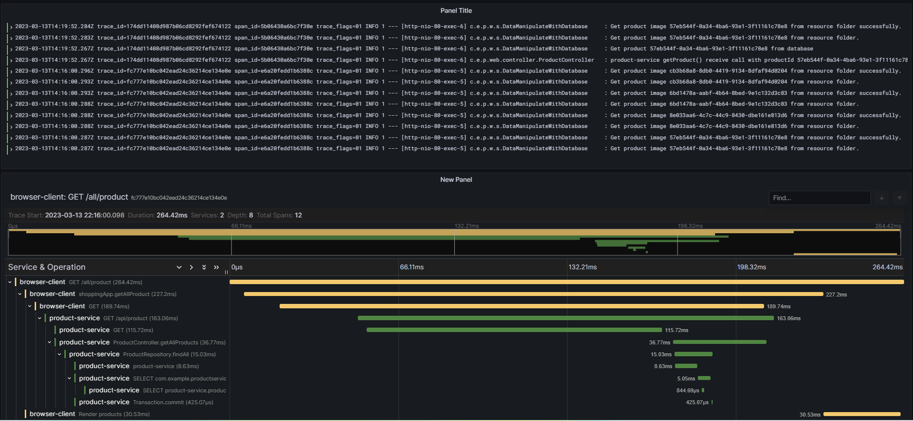

    2.GET inventory/{id}

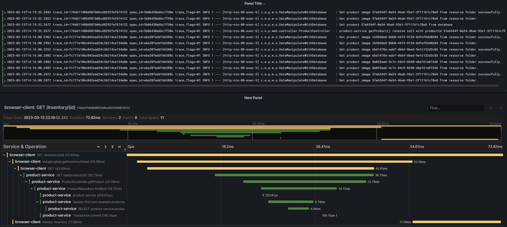

    3.POST add/product

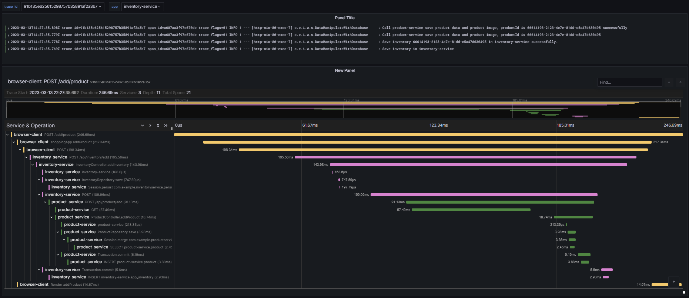

    4.POST addToCart/{id}

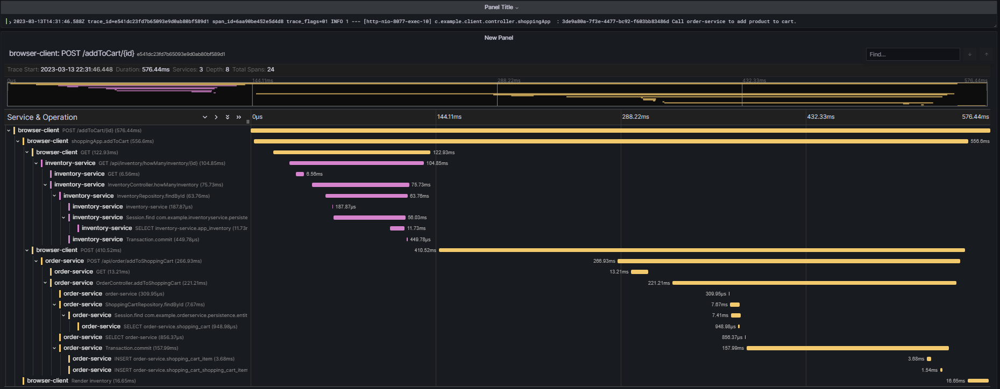

    5.GET cart

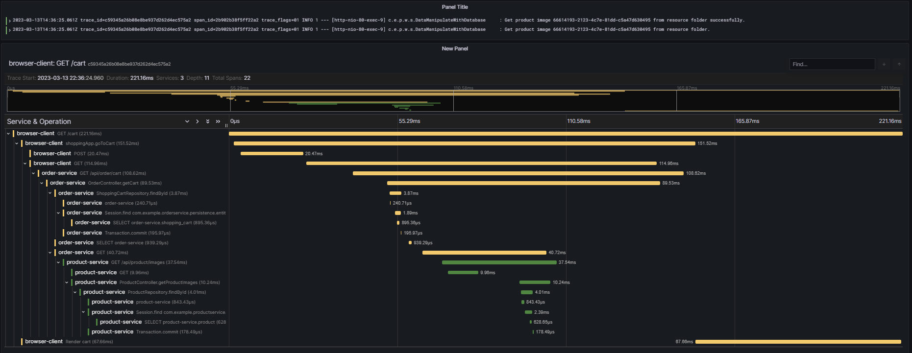

    6.GET cart/delete/{id}

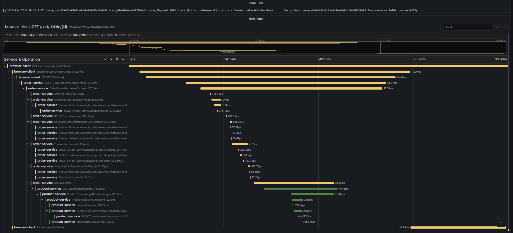

***Metric***

    1.http_server_request_count

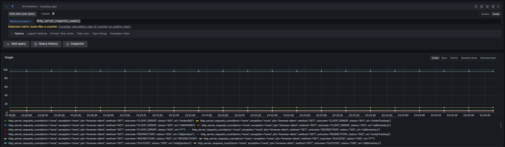

    2.process_cpu_usage

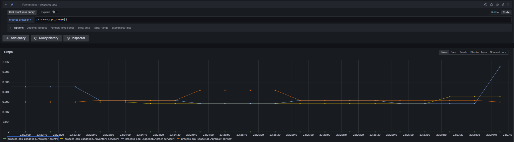

    3.spring_data_repository_invocation_count

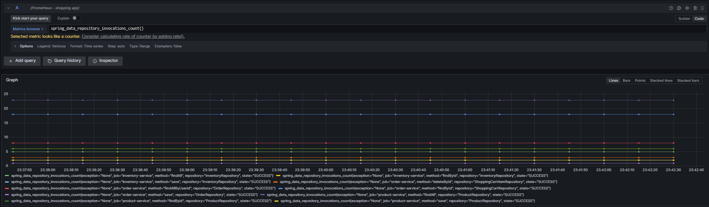

    4.system_cpu_usage

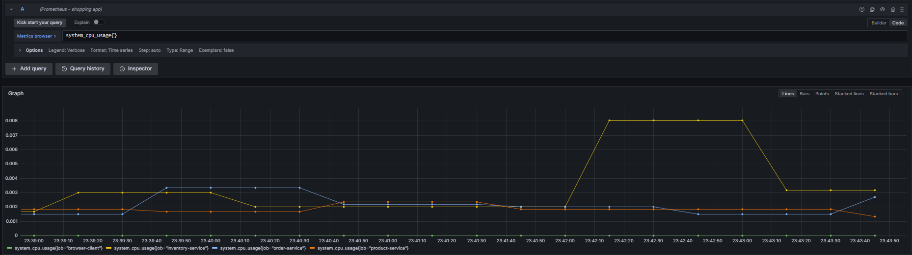

****

## Operation of App:

### Admin 

This system supplies an admin user to manage this app which has admin role. ( username: admin, password: admin )

* Login : admin can log in through filling up the credentials

* Create product: admin can add product to the inventory.

* View all product: admin can view products which in sale.

* View all Inventory: admin can view inventories.

* Logout : admin can log out by clicking the logout button on the top right.

### User

* Register user : through login page, you can register a user by register link, and will be mapped a user role by default.

* Login : user can log in through filling up the credentials.

* Logout : user can log out by clicking the logout button on the top right.

* View all product: user can view products which in sale.

* Add to cart: user can add number of product to cart.

* View cart: user can see which product have been added to cart.

* Place Order: user can select which products in cart which will form an order after clicking the place order button.

* Order tracking: user can view the status and product detail of order.

****

### Conclusion
When building this cloud native application in microservices architecture, I chose Spring Cloud to build some 
common pattern in distributed system for the sake of learning Spring Cloud, but Kubernetes(K8S) also supply
features which are comparable with Spring cloud features and can replace some features Spring Cloud supplies
, as the result when building a distributed system in the cloud, people needs to choose between K8S 
and Spring Cloud through comparing their pros and cons, and then select the better solution for 
building the app in the microservices' architecture.

